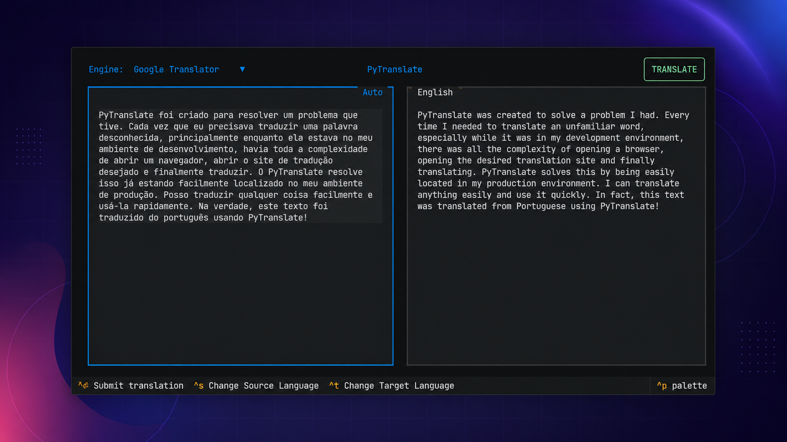

# PyTranslate

A beautiful, modern and delightful translator TUI written in Python.



## Description

PyTranslate was built to solve a problem I had. Every time I needed to translate an unknown word, especially while it was in my development environment, there was all the complexity of opening a browser, opening the desired translation website and finally translating. PyTranslate solves this by already being easily located in my production environment. I can easily translate anything and quickly use it. In fact, this text was translated from Portuguese using PyTranslate!

## Installation

1. Install UV package manager for python.

    - MacOS/Linux:

    ```sh
    curl -LsSf https://astral.sh/uv/install.sh | sh
    ```

    - Windows:
    Follow the instructions on the official website [here](https://docs.astral.sh/uv/getting-started/installation/#__tabbed_1_2).

2. Let UV do the work for you.

    ```sh
    # Will also quickly install python 3.14 if needed
    uv tool install --python 3.14 pytranslate-tui
    ```

3. Now you can easily run the application from the command line.

    ```sh
    pyt
    ```

## See also

- [Roadmap](./roadmap.md)
- [How to contribute](./CONTRIBUTING.md)
- [deep-translator](https://github.com/nidhaloff/deep-translator)
- [Textual](https://github.com/textualize/textual/)
- [Posting](https://github.com/darrenburns/posting)
